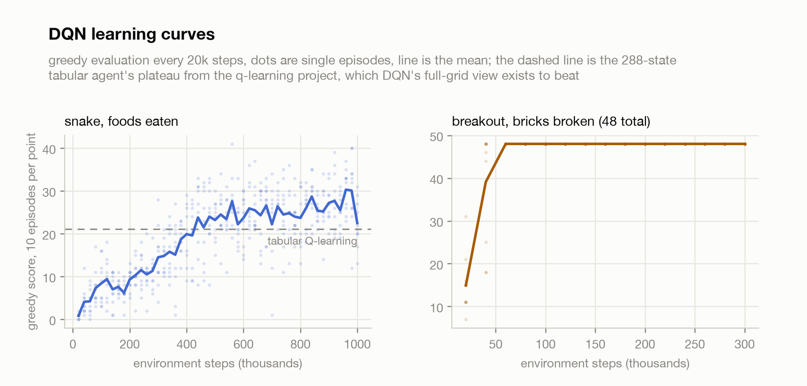
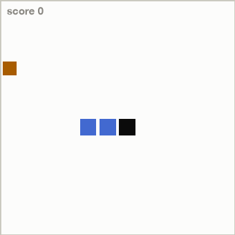
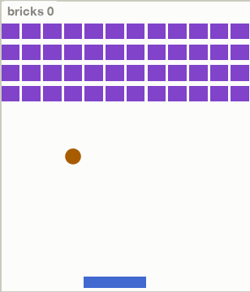

# Deep Q-learning

DQN (Mnih et al., 2013, 2015) written from scratch: the same Bellman update as
tabular Q-learning, but Q is a small convolutional network over the game
screen, made stable by the paper's two tricks, experience replay and a frozen
target network. This project picks up exactly where the
[q-learning](../q-learning) project left off. There, snake plateaued at 21
foods because its 288-state encoding could not see the snake's own body. Here
the network sees the whole grid, and the question is whether that view is
worth the extra machinery.

These are my own small grid games, not the Atari emulator. The environments
are the point of comparison with the tabular project, so I kept them in the
same family: snake on the same 12x12 board, and breakout as the harder new
game (12x14 field, 48 bricks, four rows).

## The result

| game | tabular Q-learning | DQN | verdict |
|---|--:|--:|---|
| snake, mean foods (best) | 21.1 (44) | **27.7** (42) | plateau broken |
| breakout, bricks of 48 | not attempted | **48.0** | perfect clear, every episode |

<picture>
  <source media="(prefers-color-scheme: dark)" srcset="assets/curves_dark.png">
  
</picture>

Snake crosses the tabular ceiling around 450k steps and settles near 25 to 28,
with single episodes up to 42. The failure mode that capped the table is
visibly gone: the network routes around its own body, and the replay below
shows it threading through corridors of itself that the 288-state agent died
in. What remains is the endgame, where the snake fills a third of the board
and one wrong turn seals it in.

Breakout gets demolished. By 60k steps the greedy policy clears all 48 bricks
on every evaluation episode and never regresses. Deterministic ball physics
and a 3-action paddle make it an easy target for Q-learning once the value of
"be under the ball" propagates back from the paddle bounces.

<table>
  <tr>
    <td><picture>
      <source media="(prefers-color-scheme: dark)" srcset="assets/snake_dark.gif">
      
    </picture></td>
    <td><picture>
      <source media="(prefers-color-scheme: dark)" srcset="assets/breakout_dark.gif">
      
    </picture></td>
  </tr>
</table>

## What DQN adds to Q-learning

The update target is the one from Watkins: reward plus gamma times the max
next-state Q. Three things change around it, all in [dqn.py](src/dqn.py) and
[train.py](src/train.py):

1. Q(s, a) is a network: two 3x3 conv layers into a 256-unit dense layer, one
   output per action. The input is the game grid as binary channels (snake
   head, body, food; ball, paddle, bricks), with the previous frame stacked on
   top of the current one so motion is visible, the same reason the paper
   stacks Atari frames.
2. Experience replay: transitions go into a 100k ring buffer and training
   samples random minibatches from it, breaking the correlation between
   consecutive steps that otherwise makes the network chase its own tail.
3. A target network: the bootstrap value comes from a frozen copy of the
   network, synced every 2000 steps. Without it the target moves with every
   gradient step and training oscillates.

## Honest footnotes

- Sample cost is the price of the ceiling. The tabular snake agent trains in
  about a minute on a laptop CPU. DQN needed 1M environment steps to beat it,
  about 10 minutes on an RTX PRO 6000 and three times that on my Mac's MPS.
  At 400k steps on the Mac it scored 19.6, still below the table.
- I use Adam at 2.5e-4 where the paper used RMSProp. Modern DQN
  implementations mostly do the same; I did not compare.
- Breakout's difficulty claim is modest. My version has deterministic
  diagonal ball physics on a small grid, so "solved" here is far cheaper than
  solving Atari Breakout from pixels.
- Snake actions are absolute (up/right/down/left) and moving into your own
  neck is treated as keeping course, where the tabular version used
  turn-relative actions. The two agents therefore differ in action space as
  well as in state, and the comparison is table-vs-network as packages, not a
  single-variable ablation.
- Replay GIFs are truncated at 400 frames, so both clips end mid-game. The
  recorded snake episode finished at 35 foods; breakout finished the full
  clear.
- One seed per game. The tabular numbers came from 5 seeds; rerunning DQN
  across seeds would firm up the 27.7, and eval variance between checkpoints
  (see the dots in the curve) is real, single 10-episode evals swing by 5 or
  more.

## Reproduce

```bash
pip install -r requirements.txt
python src/train.py --game snake --steps 1000000
python src/train.py --game breakout --steps 300000
python src/plots.py
```

train.py picks cuda, then mps, then cpu. It writes `assets/<game>.json` with
the eval history and a replay, plus `assets/<game>.pt` weights (not checked
in). plots.py rebuilds the chart and both GIFs from the JSONs.

## References

- Mnih et al. (2013), [Playing Atari with Deep Reinforcement Learning](https://arxiv.org/abs/1312.5602).
- Mnih et al. (2015), Human-level control through deep reinforcement learning, Nature 518.
- Watkins & Dayan (1992), [Q-learning](https://link.springer.com/article/10.1007/BF00992698). The update rule underneath all of it.
