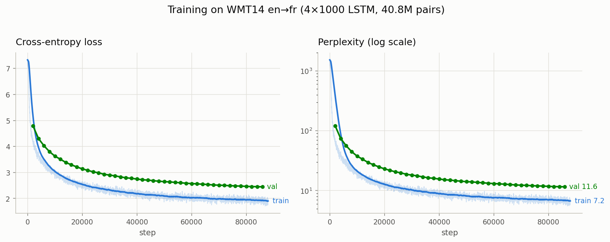

# Sequence-to-sequence machine translation (English to French)

A from-scratch reimplementation of Sutskever, Vinyals & Le (2014), *Sequence to
Sequence Learning with Neural Networks*, the paper that showed a plain stacked
LSTM, with no attention and no alignment model, can translate. The whole point of
that paper is that you can read a sentence one word at a time into a fixed-size
vector and then unroll a translation out of that same vector, and it works well
enough to rival the phrase-based systems of the time.

I built it in two passes. First I wrote the LSTM cell and the encoder/decoder loop
by hand ([`src/model.py`](src/model.py)) so I couldn't hide behind a library and
had to get the gate equations and the state hand-off right. Then, once I trusted
it, I swapped the per-timestep Python loop for cuDNN's fused `nn.LSTM`
([`src/model_fast.py`](src/model_fast.py)), which is about 4.5x faster and is what
I actually trained with. The hand-written version stays in the repo as the
reference I check against.

Trained on all 40.8M WMT14 en-fr sentence pairs on a single GPU.

## Results

Scored on newstest2013 (3,000 sentences, the split Hugging Face calls `validation`
for `wmt14`). Metrics from `sacrebleu` (BLEU, chrF, TER) and `rouge-score`.

| Decoding | BLEU ↑ | chrF ↑ | TER ↓ | ROUGE-L ↑ |
|---|:--:|:--:|:--:|:--:|
| Greedy | 12.9 | 38.8 | 81.7 | 39.0 |
| Beam search (width 5, length penalty 0.6) | **14.5** | **39.8** | **77.5** | **41.0** |

Beam search buys about +1.6 BLEU over greedy, which is roughly what you'd expect.

<picture>
  <source media="(prefers-color-scheme: dark)" srcset="assets/training_curves_dark.png">
  
</picture>

Training loss keeps falling but validation flattens out around perplexity 11 to 12,
so there's a normal train/val gap opening up. I stopped at 88k steps, which is only
about half an epoch over the full 40.8M pairs. The curves make it pretty clear the
model was still improving and I ran out of GPU time rather than out of gains.

### How this compares to the paper

Not directly, and I want to be honest about why:

- The paper reports BLEU on **newstest2014** (the test set); I'm reporting on
  **newstest2013** (the validation set), because that's what was conveniently
  available and I wanted a held-out number I hadn't touched. Different test set,
  so the numbers aren't comparable line-for-line.
- Their single reversed LSTM gets about 30.6 BLEU and their 5-model ensemble gets
  34.81 (with an SMT baseline at 33.30). But they train for about 7.5 epochs on a
  12M subset with a 160k/80k **word** vocabulary and 384M parameters. I trained
  about 0.5 epoch with a 32k byte-level **BPE** vocabulary and 160M parameters.

So 14.5 BLEU is well short of the paper, and most of that gap is training budget
and vocabulary, not the architecture. The interesting part to me was watching it
work at all.

## Example translations

A spread from across newstest2013 (beam-search outputs). The full set of 3,000,
greedy and beam, is in [`assets/translations.jsonl`](assets/translations.jsonl).

| English | Model | Reference |
|---|---|---|
| Or alternatively we would be forced out of the market in the respective sector. | Ou encore, nous serions contraints d'abandonner le marché dans le secteur concerné. | Ou alors, nous perdrions notre place sur le segment du marché en question. |
| Who was the best Puerto Rican manager? | Qui était le meilleur gestionnaire de Porto Rico ? | Qui a été le meilleur dirigeant portoricain ? |
| No traffic hold-ups have so far been reported. | Aucun trafic de trafic n'a été signalé jusqu'à présent. | Aucune difficulté de circulation n'a été signalée pour le moment. |
| The Army private is accused of stealing thousands of classified documents | L'armée est accusée d'avoir volé des milliers de documents classifiés | Le soldat est accusé d'avoir dérobé des milliers de documents confidentiels. |
| I am not a hundred dollar bill to please all. | Je ne suis pas un projet de loi de 100 cents. | Je ne suis pas un billet de cent dollars pour plaire à tout le monde. |
| A Republican strategy to counter the re-election of Obama | Une stratégie de la Republika Srpska visant à renverser la décision de l'ex-République yougoslave de Macédoine | Une stratégie républicaine pour contrer la réélection d'Obama |
| "Valentino prefers elegance to notoriety" | « Volonto préférer la beauté de l'univers » | « Valentino préfère l'élégance à la notoriété » |

The pattern is consistent and, I think, exactly what you'd predict for a
no-attention model with a fixed vocabulary:

- **Grammar and common phrasing are good.** "Une chose est certaine",
  "nous serions contraints d'abandonner le marché", agreement and word order are
  usually right. The French reads like French.
- **Rare words and named entities fall apart.** "Republican" becomes "Republika
  Srpska", "Valentino" becomes "Volonto", a person named Fatulayeva becomes
  "Fawson". The model has never seen these often enough and reaches for something
  frequent instead.
- **Idioms get translated literally.** "a hundred dollar bill" turns into "un
  projet de loi de 100 cents" (it read *bill* as *legislation*), and "traffic
  hold-ups" turns into "trafic de trafic".

The named-entity problem is the exact thing attention (Bahdanau et al., 2015) fixed
the following year, by letting the decoder look back at the source instead of
squeezing everything through one vector.

## The model

Standard encoder-decoder. Both sides are 4-layer LSTMs with 1000 hidden units and
1000-dimensional embeddings (about 160M parameters total).

- The **encoder** reads the source sentence and its final `(hidden, cell)` state
  for every layer becomes the decoder's initial state. That stack of states is the
  entire "meaning" the decoder gets, and there is no attention.
- The **decoder** is trained with teacher forcing: it's given `[<bos>, w1, ..., wn]`
  and has to predict `[w1, ..., wn, <eos>]`, one shifted position over.
- **The source sentence is reversed** before it goes into the encoder. This is the
  paper's main trick and it's almost free. Reversing the input puts the first few
  source words right next to the first few target words in time, which gives the
  optimizer short dependencies to latch onto early. It lives in the collate
  function ([`src/data.py`](src/data.py)).
- `<pad>` is token id 0 so it lines up with `nn.Embedding(padding_idx=0)`, and the
  loss ignores it. The fast encoder also packs the padded batch so trailing pad
  steps don't corrupt the final state.

Two implementations of the same architecture:

- [`src/model.py`](src/model.py): hand-written `LSTMCell` (the four gates as plain
  matrix multiplies), stacked into layers, unrolled over time in Python. Slow, but
  it's the version I actually understand.
- [`src/model_fast.py`](src/model_fast.py): the same thing on cuDNN's `nn.LSTM`,
  which runs the whole sequence in one fused call.

## Data

WMT14 en-fr from Hugging Face (`wmt/wmt14`, config `fr-en`). It's about 40.8M
sentence pairs, so I stream it rather than downloading the whole thing, tokenize
once, and store the token ids as flat NumPy `int32` arrays (about 12 GB) that
memory-map back in instantly. An earlier version kept the ids as Python lists and
used about 80 GB of RAM, which got the process OOM-killed. The packed layout is in
[`src/data.py`](src/data.py) and the mistake was worth making once.

Tokenization is a separate byte-level BPE per language, 32k vocab each, trained on
the first 3M sentences (a few million lines already saturate a 32k vocab).

## Training

| | |
|---|---|
| Hardware | 1x RTX PRO 6000 Blackwell |
| Optimizer | Adam, lr 7e-4, gradient clipping at 5.0 |
| Batch size | 256 |
| Objective | token cross-entropy, teacher forcing, pad ignored |
| Throughput | about 90k target tokens/s (cuDNN LSTM) |
| Steps | 88k (about 0.5 epoch) |
| Logging / checkpoints | Weights & Biases, checkpoints every 1k steps |

Two practical notes if you try to reproduce this on an ephemeral cloud box.
Checkpoints are written atomically (temp file plus rename) and pushed to W&B as
artifacts every 5k steps, so a checkpoint is never half-written and never lives
only on a disk that's about to disappear. My training box was time-limited and did
disappear; the artifacts are why the model survived it, and `--resume` picks up
from the latest one.

## Reproduce

```bash
pip install -r requirements.txt

# train (streams + caches the corpus on first run, then starts stepping)
# hyperparameters live in config.yaml
python -m src.train --out-dir artifacts

# resume from a checkpoint
python -m src.train --resume artifacts/ckpt_latest.pt

# translate + score on the full newstest set with beam search
python -m src.eval --ckpt-file artifacts/ckpt_latest.pt --beam 5

# quick qualitative check on a handful of sentences
python -m src.translate --ckpt-file artifacts/ckpt_latest.pt --num-eval 20
```

## Repository layout

```
config.yaml       model + optimization hyperparameters
requirements.txt  dependencies
src/
  model.py        hand-written LSTM encoder/decoder (reference)
  model_fast.py   cuDNN nn.LSTM version (used for training), greedy decode
  data.py         streaming, BPE tokenizers, packed corpus, reversing collate
  train.py        training loop, checkpoint/resume, W&B logging
  eval.py         greedy + beam search, BLEU/chrF/TER/ROUGE
  translate.py    load a checkpoint and translate sentences
assets/
  training_curves_*.png   loss + perplexity curves
  translations.jsonl      all 3,000 newstest translations (greedy + beam)
```

## What I'd try next

- **Train longer.** The validation curve hadn't plateaued; even another epoch or
  two should help before anything fancier.
- **Add attention.** This is the obvious next step and directly attacks the
  rare-word failures above. It's also the natural bridge to the Transformer.
- **Bigger beam plus a coverage penalty**, and score on newstest2014 so the number
  is comparable to the paper.
- **BPE dropout** for a bit of regularization on the source side.

## References

- Sutskever, Vinyals, Le (2014). [Sequence to Sequence Learning with Neural Networks](https://arxiv.org/abs/1409.3215).
- Bahdanau, Cho, Bengio (2015). [Neural Machine Translation by Jointly Learning to Align and Translate](https://arxiv.org/abs/1409.0473).
