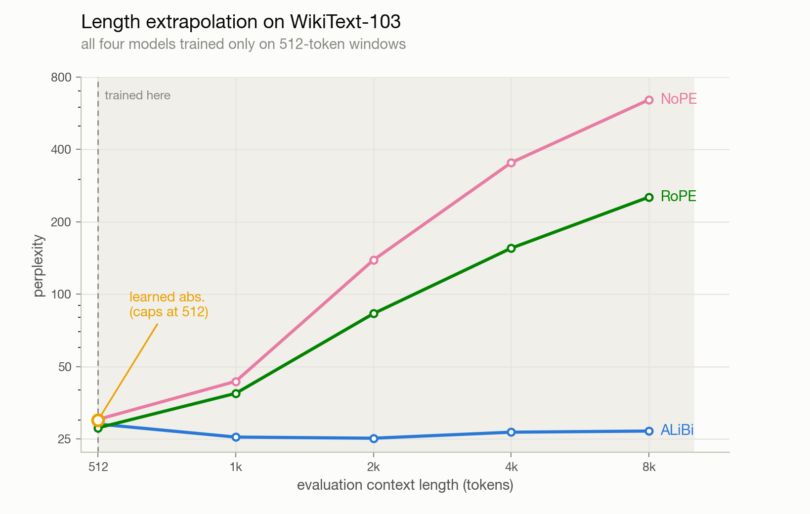
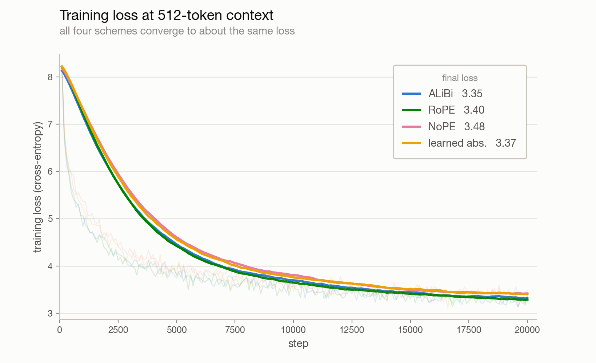
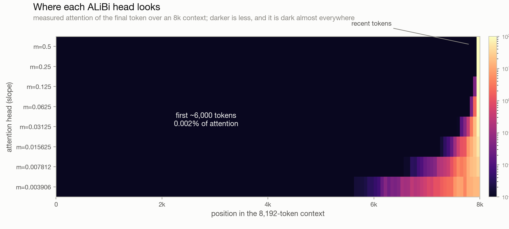

# Positional encodings and length extrapolation

A controlled comparison of four ways a transformer can know where a token sits in
the sequence, and what happens to each one when you evaluate on sequences far
longer than it ever trained on. The headline question, taken straight from the
ALiBi paper (Press et al., 2021), is "train short, test long": if you only ever
show the model 512-token windows, how well does it handle 8,192 at test time?

I trained the same 51M-parameter GPT four times, changing only the positional
scheme, and evaluated each at context lengths from 512 up to 8,192.

I wrote the attention by hand first ([`src/model.py`](src/model.py), plain
softmax with an explicit ALiBi bias and a RoPE rotation) so I understood exactly
what each scheme does to the attention scores, then wrote a faster twin
([`src/model_fast.py`](src/model_fast.py)) on top of
`scaled_dot_product_attention`. The two agree to 1e-7, so the fast version is what
I actually trained with.

## The result

Perplexity on WikiText-103 validation, evaluated at each context length. Lower is
better. Every model trained only on 512-token windows.

| scheme | 512 | 1,024 | 2,048 | 4,096 | 8,192 |
|---|--:|--:|--:|--:|--:|
| learned absolute | 29.9 | n/a | n/a | n/a | n/a |
| RoPE | **27.8** | 38.7 | 83.1 | 155.4 | 253.5 |
| ALiBi | 28.9 | **25.5** | **25.2** | **26.7** | **27.0** |
| NoPE (none) | 30.2 | 43.4 | 138.8 | 352.7 | 644.0 |

<picture>
  <source media="(prefers-color-scheme: dark)" srcset="assets/extrapolation_dark.png">
  
</picture>

The interesting part is that the ranking at the training length is almost the
reverse of the ranking under extrapolation. RoPE is the best model at 512, the
length it trained on, and it is the second worst by 8k. ALiBi is middle of the
pack at 512 and is the only scheme that stays flat, actually improving out to 2k
and sitting at 27.0 perplexity at 8k, which is 16x its training length. That is
the whole point of the paper reproduced on my own model.

The four models trained to almost the same loss, so this is not one model just
being better. It is entirely about how each scheme behaves at positions it never
saw during training.

<picture>
  <source media="(prefers-color-scheme: dark)" srcset="assets/training_loss_dark.png">
  
</picture>

## What each scheme does, and why it extrapolates the way it does

**Learned absolute** is a lookup table `nn.Embedding(max_len, d_model)` added to the
token embeddings. It is the original GPT-2 approach. It does not extrapolate badly,
it literally cannot run past its table: there is no row for position 512 or beyond,
so the only honest number is the one at 512. This is why it is a single point on
the plot.

**RoPE** (rotary, Su et al., 2021) rotates the query and key vectors by an angle
that depends on their absolute position, so the dot product between two tokens ends
up depending only on their relative distance. It is the standard in modern LLMs
(LLaMA and most things since). It is the best in-distribution here, but the plain
version degrades sharply when extrapolating: at test positions well beyond training,
the relative rotations between far-apart tokens land in angle regimes the model
never saw, and attention falls apart. This is exactly the failure that position
interpolation, NTK scaling, and YaRN were invented to patch. I ran vanilla RoPE with
no such fix, which is why it blows up.

**ALiBi** (Press et al., 2021) adds nothing to the embeddings. Instead it subtracts
a penalty from each attention score that grows linearly with the distance between
the two tokens, with a different slope per head. The reason it extrapolates is
almost boring: the penalty is defined for any distance and just keeps growing, so a
longer context only adds more heavily down-weighted far tokens. Nothing about the
bias is tied to a maximum length, so there is no unseen regime to fall into.

**NoPE** is a decoder with no positional signal at all. It is not useless, because
the causal mask already breaks the symmetry between positions, so the model can
infer position by counting (Haviv et al., 2022). It learns fine at 512, but here it
extrapolates the worst of the four. Some papers report NoPE extrapolating well at
larger scale, so I am not claiming this is the last word, just what happened at 51M
parameters on this dataset.

## The catch with ALiBi

Honestly, I did not buy that ALiBi would just work this cleanly. A flat line out to
16x the training length felt too good, and I figured there had to be a catch. Then it
clicked: at 8k, a token near the start of the sequence is about 8,000 positions away
from the query, so its ALiBi penalty is enormous, and after softmax that has to be
essentially zero attention. My hypothesis was that ALiBi is not extrapolating at all,
it is just ignoring the early context it was never going to handle.

So I checked. I pulled the actual attention activations out of the trained ALiBi model
on a real 8,192-token sequence and looked at where the last token attends.

<picture>
  <source media="(prefers-color-scheme: dark)" srcset="assets/attention_heatmap_dark.png">
  
</picture>

It is dark almost everywhere. The final token sends 98% of its attention to the last
512 tokens, and the first 6,000 tokens of the 8k context receive 0.002% between them.
Each head has its own bounded reach set by its slope, the steep heads at the top only
look at the last handful of tokens and the shallowest head at the bottom stretches
back a couple thousand, but none of them touch the early context. So ALiBi's graceful
extrapolation is not it handling long context. It is ALiBi filtering out the far
context the model cannot deal with, and quietly behaving like a set of local sliding
windows. The other schemes try to actually represent every position and fall apart the
moment they hit positions they never trained on. ALiBi sidesteps the whole problem by
not looking.

You can see the same thing in the perplexity curve above. ALiBi improves from 28.9 at
512 to 25.2 at 2k, roughly where its widest heads still reach, then plateaus out to 8k.
A model that was really using the extra context would keep improving, not flatten.

This is most likely why frontier labs still build on RoPE rather than ALiBi. RoPE tries
to encode every position for real, which is more fragile out of the box (the blow-up
above) but can genuinely exploit long context once you rescale its rotation frequencies
with position interpolation or NTK / YaRN. ALiBi buys its robustness by giving up
long-range modeling, and at scale that is a bad trade, so the field kept RoPE and fixed
its extrapolation instead.

## The model

A standard pre-norm decoder-only transformer: 8 layers, `d_model` 512, 8 heads,
`d_ff` 2048, GPT-2 BPE vocabulary (50,257), roughly 51M parameters. The only thing
that changes between runs is the `pos_encoding` argument on `GPT`, which selects
learned / rope / alibi / none.

Two implementations of the same architecture:

- [`src/model.py`](src/model.py) is the readable reference. Attention is the plain
  `softmax(QK^T / sqrt(d)) V` with the causal mask, the ALiBi bias, and the RoPE
  rotation all written out.
- [`src/model_fast.py`](src/model_fast.py) is the same model on
  `scaled_dot_product_attention`. Causal, RoPE, and NoPE all take the fused flash
  kernel via `is_causal`. ALiBi passes an additive bias as `attn_mask`, which in
  stock PyTorch routes to the memory-efficient backend rather than the true flash
  kernel (flash in core PyTorch does not accept an additive mask). Real flash plus
  ALiBi needs the `flash-attn` package's `alibi_slopes` argument.

## Data

WikiText-103 (`Salesforce/wikitext`, the parquet mirror, since the old `wikitext`
script loader is broken on datasets 5.0), tokenized once with GPT-2 BPE into a flat
`uint16` array. That is about 118M training tokens and 247k validation tokens. Both
are memory-mapped, so nothing large sits in RAM. Training draws random 512-token
windows; the length sweep uses non-overlapping windows of each eval length over the
validation stream.

## Training

| | |
|---|---|
| Hardware | 1x RTX PRO 6000 Blackwell, bf16 |
| Optimizer | AdamW, lr 3e-4, betas (0.9, 0.95), weight decay 0.1 |
| Schedule | 500-step warmup then cosine to 0.1x |
| Batch / context | 32 windows of 512 tokens |
| Steps | 20,000 per scheme (about 2.8 passes over the corpus) |
| Throughput | about 15 steps/s |

## Reproduce

```bash
pip install -r requirements.txt

# trains one scheme, then runs the 512 to 8192 length sweep and writes runs/<pos>_extrapolation.json
python src/train.py --pos alibi
python src/train.py --pos rope
python src/train.py --pos learned
python src/train.py --pos none
```

## Repository layout

```
config-free; hyperparameters are flags on train.py
requirements.txt
src/
  model.py        hand-written attention with ALiBi / RoPE / causal mask (reference)
  model_fast.py   same model on scaled_dot_product_attention (used for training)
  train.py        train one scheme, then evaluate perplexity from 512 to 8192
assets/
  extrapolation_*.png       perplexity vs context length (the main result)
  attention_heatmap_*.png   measured attention of the final token over an 8k context
  training_loss_*.png       the four training curves
  results.json              the perplexity numbers
  attention*.json           the measured attention data behind the heatmap
```

## Caveats

This is a small, single-seed study. One 51M model per scheme, one dataset, one run
each, no averaging over seeds. RoPE is the vanilla version with no interpolation, so
its poor extrapolation is expected and is not a knock on RoPE as used in practice.
The point was to see the four behaviors cleanly on hardware I could actually run, not
to produce a leaderboard number.

## What I'd try next

- **RoPE with position interpolation or NTK / YaRN scaling**, to show the fix that
  makes RoPE the extrapolation workhorse it actually is today.
- **Multiple seeds**, so the small differences at 512 mean something.
- **Push past 8k** and switch to PG-19 (book-length documents), where 8k is not even
  a long context.
- **A bigger model**, to check whether NoPE's reputation for extrapolating well shows
  up at scale.

## References

- Press, Smith, Lewis (2021). [Train Short, Test Long: Attention with Linear Biases Enables Input Length Extrapolation](https://arxiv.org/abs/2108.12409).
- Su et al. (2021). [RoFormer: Enhanced Transformer with Rotary Position Embedding](https://arxiv.org/abs/2104.09864).
- Haviv et al. (2022). [Transformer Language Models without Positional Encodings Still Learn Positional Information](https://arxiv.org/abs/2203.16634).
- Vaswani et al. (2017). [Attention Is All You Need](https://arxiv.org/abs/1706.03762).
