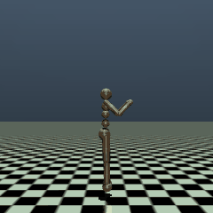
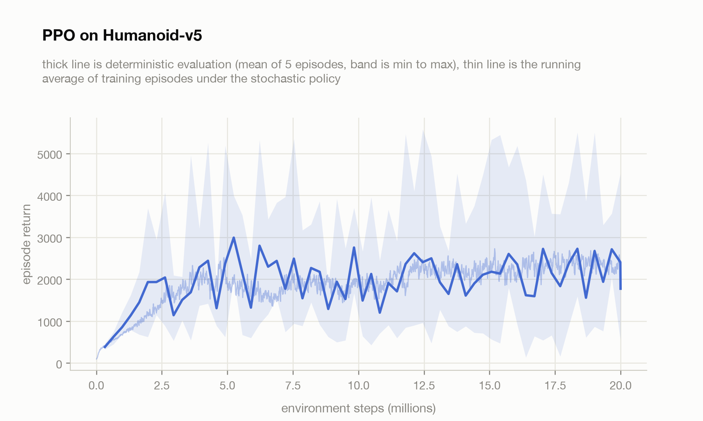
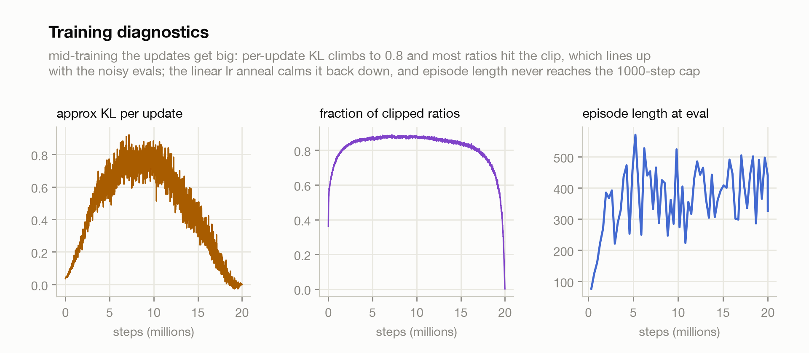

# PPO

Proximal Policy Optimization (Schulman et al., 2017) written from scratch and
pointed at the hardest standard MuJoCo task, Humanoid-v5: a 3D humanoid with a
348-dimensional state and 17 torque actuators that starts every episode
falling over. The policy has to discover standing, then walking, from nothing
but the reward for moving forward without hitting the floor.

Everything ran inside a marimo molab sandbox. MuJoCo works there directly:
physics steps headless on the CPU and offscreen rendering goes through EGL on
the GPU, so the whole loop, 32 parallel simulators, training, evaluation and
video rendering, lived in one remote box (RTX PRO 6000, 20 cores) at about
5,100 environment steps per second. The GPU is bored the entire time, PPO on
state vectors is a ~400k parameter MLP and the physics is the bottleneck.

## The result

20 million environment steps, 65 minutes, one seed. Final deterministic
evaluation over 10 episodes: mean return 2147, best episode 4103, mean episode
length 397 of the 1000-step cap.



The humanoid runs. It is not pretty, it leans deep into a hunched lurch and
throws one arm around for balance, but it covers ground fast and the best
episode lasts 11 seconds of simulated time. What it never learns in 20M steps
is to stop falling entirely: mean episode length plateaus around 400 steps, so
a typical run ends with the humanoid tripping over its own momentum after six
seconds. Reward maximization has no opinion about dignity.

<picture>
  <source media="(prefers-color-scheme: dark)" srcset="assets/learning_curve_dark.png">
  
</picture>

The shape of the curve is the honest story: a fast climb to ~2000 return in
the first 3M steps, then 17M steps of noisy plateau rather than steady
improvement. Evaluations oscillate between roughly 1500 and 2700 depending on
whether the current policy iteration happens to trip early.

<picture>
  <source media="(prefers-color-scheme: dark)" srcset="assets/diagnostics_dark.png">
  
</picture>

The diagnostics explain the plateau. Mid-training, the per-update KL between
old and new policy climbs to ~0.8 and about 85% of probability ratios hit the
clip boundary, which means the optimizer is pushing far past the trust region
on every update and the clip is the only thing holding it together. That
window is exactly where the evals are noisiest. The linear learning-rate
anneal eventually shrinks the updates back to tiny KL, which stabilizes the
policy but also freezes it, plateau included. The standard fix I did not use
is early-stopping the inner epochs on a KL threshold; that is the first thing
I would try next.

## What PPO actually is

One idea plus plumbing. The idea: vanilla policy gradient allows one gradient
step per batch of experience, because after the policy changes, the data is
off-policy and the gradient is wrong. PPO reuses each batch for 10 epochs
anyway, and guards against the staleness by clipping. For each action it
computes the ratio of new to old policy probability, multiplies by the
advantage, and clips the ratio to [0.8, 1.2] whenever moving it further would
improve the objective. Once a sample's ratio hits the clip, its gradient is
zero and that sample stops pushing. That single clamp, in
[ppo.py](src/ppo.py), is the whole trust region.

The plumbing matters as much as the clip on Humanoid, and all of it is in
[train.py](src/train.py): advantages from GAE (gamma 0.99, lambda 0.95),
observation normalization by running mean and std, reward scaling by the
running std of the discounted return, advantage normalization per minibatch,
orthogonal init with a small-gain policy head, a learned state-independent
log std, and the lr anneal. Strip the observation normalization and this task
simply does not train, the raw state mixes joint angles with 300-scale
contact forces.

## Honest footnotes

- One seed, and PPO on Humanoid is seed-sensitive. Published PPO curves for
  this task at comparable budgets land anywhere from 600 to 6000; my 2147
  mean is inside that band but a 5-seed study would be the real number.
- The policy samples from an unsquashed Gaussian and lets the environment
  clip actions to [-0.4, 0.4]. Standard practice, but it means early
  training saturates the actuators constantly.
- Episode length never reaches the cap, so "learned to run" means "runs for
  six seconds on average, eleven at best". A stable indefinite runner needs
  either more steps, KL early stopping, or a bigger recipe change (SAC gets
  there reliably but is a different paper).
- The GIF is the best final episode (return 4103), not a typical one, and it
  is rebuilt deterministically from the saved qpos/qvel trajectory in
  results.json by [render.py](src/render.py), so the video in this README is
  the actual evaluated episode, not a cherry-picked re-roll.
- Training used gymnasium's AsyncVectorEnv and ClipAction wrappers; the
  algorithm itself (GAE, normalization, clipped update) is all hand-written.

## Reproduce

```bash
pip install -r requirements.txt
MUJOCO_GL=egl python src/train.py
python src/render.py
python src/plots.py
```

train.py writes `assets/results.json` (history, final eval, best trajectory)
and a checkpoint, evaluating and checkpointing every 40 updates so a killed
run keeps its progress. render.py replays the stored trajectory through
MuJoCo to rebuild the GIF; plots.py rebuilds both charts from the JSON. On
CPU only, expect hours instead of one; the run itself needs no GPU, only
rendering benefits from EGL.

## References

- Schulman et al. (2017), [Proximal Policy Optimization Algorithms](https://arxiv.org/abs/1707.06347).
- Schulman et al. (2015), [High-Dimensional Continuous Control Using Generalized Advantage Estimation](https://arxiv.org/abs/1506.02438).
- Towers et al., [Gymnasium](https://gymnasium.farama.org/), and DeepMind's [MuJoCo](https://mujoco.org/). The simulator and task, everything I did not write.
