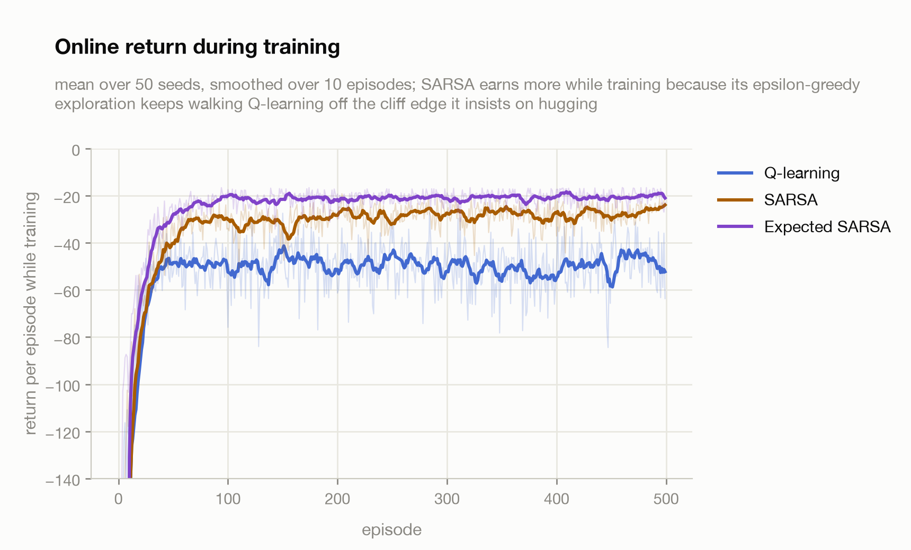
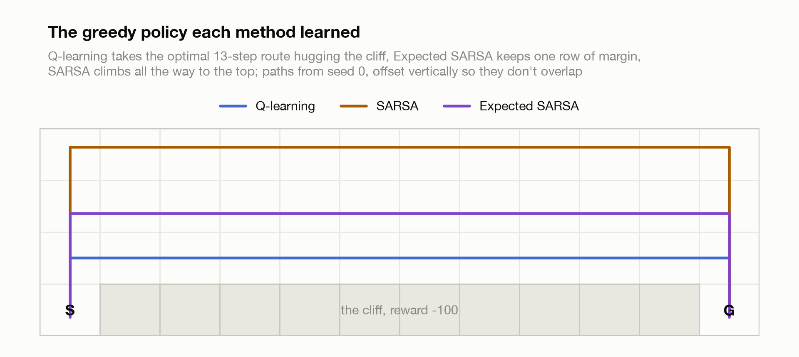
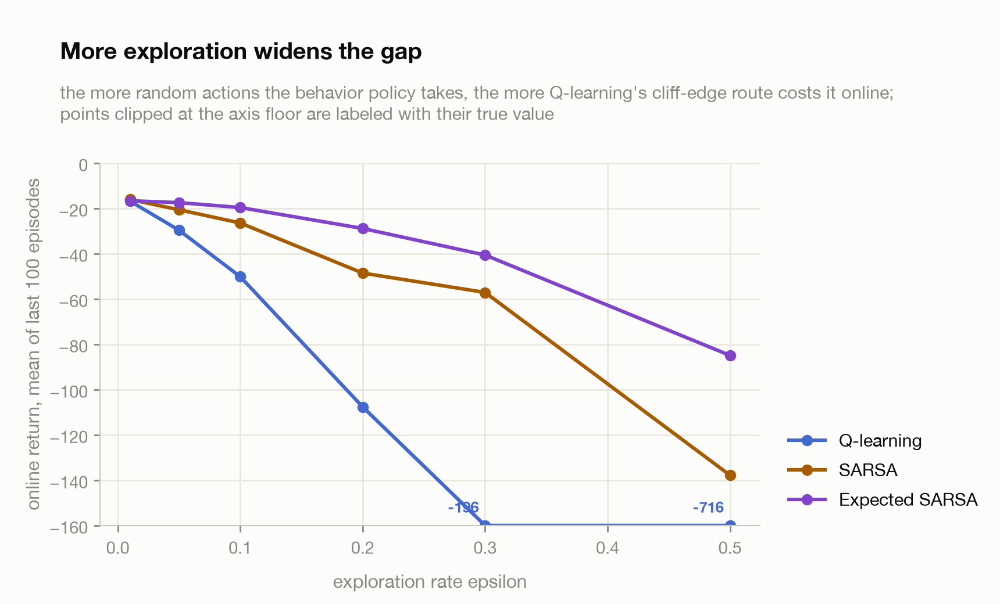
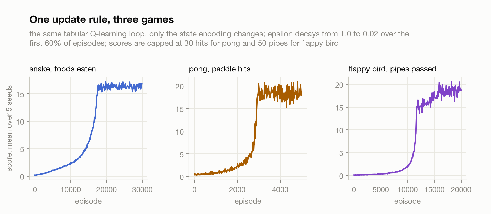
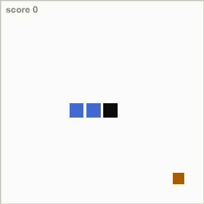
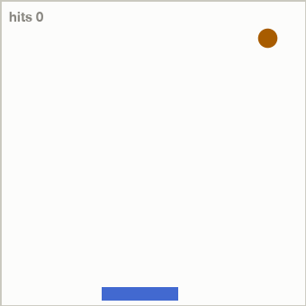
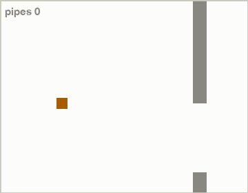

# Q-learning

Tabular Q-learning (Watkins, 1989; Watkins & Dayan, 1992) written from
scratch, next to SARSA and Expected SARSA, on the cliff walking gridworld from
Sutton & Barto, and then the same update rule playing snake, pong and flappy
bird. The point of the exercise is the one idea that made Q-learning famous:
it learns the value of the greedy policy while behaving with a different,
exploratory policy. Cliff walking is the cleanest place to watch what that
buys you and what it costs, and the games show how far a lookup table gets you
once you pick the right state features.

The environment is a 4x12 grid. You start at the bottom left, the goal is at
the bottom right, and the ten cells between them are a cliff. Every step costs
-1, stepping into the cliff costs -100 and teleports you back to the start.
The optimal route is 13 steps along the cliff edge.

## The result

500 episodes, epsilon-greedy behavior with epsilon 0.1, learning rate 0.5,
gamma 1.0, averaged over 50 seeds.

| method | return while training (last 100 ep) | greedy policy return | greedy reaches goal |
|---|--:|--:|--:|
| Q-learning | -48.6 | **-13.0** | 50/50 |
| SARSA | -27.4 | -31.9 | 41/50 |
| Expected SARSA | **-20.5** | -15.0 | 50/50 |

The two columns disagree, and that disagreement is the whole lesson.
Q-learning earns the least while training but its final greedy policy is
optimal on every seed. SARSA earns much more while training but its greedy
policy is worse. Neither method is broken, they are answering different
questions: Q-learning learns "what is the best I could do if I stopped
exploring", SARSA learns "what is the best I can do given that I keep
exploring 10% of the time".

<picture>
  <source media="(prefers-color-scheme: dark)" srcset="assets/online_return_dark.png">
  
</picture>

You can see the disagreement directly in the routes each greedy policy takes:

<picture>
  <source media="(prefers-color-scheme: dark)" srcset="assets/paths_dark.png">
  
</picture>

Q-learning walks the 13-step path one row above the cliff. That path is
optimal for a greedy agent and terrible for an epsilon-greedy one, because
every step along it has a 1-in-40 chance of a random "down" action costing
-100, which is exactly why its training curve sits around -49 instead of -13.
SARSA's updates use the action it actually takes next, so the exploration
noise is priced into its Q values and it learns the 17-step route along the
top, as far from the cliff as possible. Expected SARSA averages over the
epsilon-greedy distribution instead of sampling it, which removes the sampling
noise, and it settles on the middle row: 15 steps, one row of safety margin.
This is Example 6.6 from Sutton & Barto and all three behaviors reproduce.

The gap is a function of how much exploration the behavior policy does. Rerun
the same experiment at different epsilons and Q-learning's online return
collapses while the on-policy methods degrade gracefully:

<picture>
  <source media="(prefers-color-scheme: dark)" srcset="assets/epsilon_sweep_dark.png">
  
</picture>

At epsilon 0.01 all three methods are within a point of each other, because
with almost no exploration the on-policy and greedy value functions almost
coincide. At epsilon 0.5 Q-learning's online return is -716: it still insists
on the cliff-edge path even though half its actions are random, so it falls
constantly. It never learns not to, because its update rule literally cannot
see its own exploration.

## The update rules

All three methods share the same TD skeleton and differ only in one term: the
value of the next state they bootstrap from. Q-learning uses the max over next
actions. SARSA uses the Q value of the action it actually takes next. Expected
SARSA uses the expectation of Q under the epsilon-greedy policy. That's one
line of difference each, in [train.py](src/train.py).

The max is what makes Q-learning off-policy: its target is the greedy value no
matter what the agent does next, which is also what makes it converge to the
optimal Q under any behavior policy that keeps visiting every state-action
pair. That convergence is the claim Watkins & Dayan proved.

## The same rule on actual games

Cliff walking has 48 states you could enumerate by hand. To show the same
algorithm coping with something livelier, [games.py](src/games.py) implements
snake, pong and flappy bird as small discrete environments, and
[train_games.py](src/train_games.py) trains plain Q-learning on each one, 5
seeds per game, epsilon decaying from 1.0 to 0.02. Nothing about the update
rule changes between games. The only real work is deciding what the state is.

| game | states | actions | state features | episodes | greedy score, mean (max) |
|---|--:|--:|---|--:|--:|
| snake | 288 | 3 | heading, danger left/ahead/right, food direction | 30,000 | 21.1 (44) |
| pong | 5,760 | 3 | ball cell, ball velocity, paddle position | 5,000 | 30.0 (cap) |
| flappy bird | 900 | 2 | distance to pipe, height vs gap, velocity | 20,000 | 49.2 (50) |

<picture>
  <source media="(prefers-color-scheme: dark)" srcset="assets/games_dark.png">
  
</picture>

Each game shows the same S-curve: a long flat stretch while epsilon is high
and the table is filling in, then a sharp takeoff once the values are good
enough for the greedy action to usually be right, then a plateau set by the
limits of the state representation. Here are the learned greedy policies
playing:

<table>
  <tr>
    <td><picture>
      <source media="(prefers-color-scheme: dark)" srcset="assets/snake_dark.gif">
      
    </picture></td>
    <td><picture>
      <source media="(prefers-color-scheme: dark)" srcset="assets/pong_dark.gif">
      
    </picture></td>
    <td><picture>
      <source media="(prefers-color-scheme: dark)" srcset="assets/flappy_dark.gif">
      
    </picture></td>
  </tr>
</table>

Pong gets solved outright: the dynamics are deterministic, 5,760 states is
nothing, and every seed reaches the 30-hit cap on every greedy episode.
Flappy bird is nearly solved, 49.2 of a possible 50 pipes on average. Snake is
the interesting failure. Its 288-state encoding sees only the adjacent cells
and the direction of the food, not the shape of its own body, so around 20
foods the snake is long enough to trap itself in coils its state literally
cannot represent. Average greedy score 21, best run 44 on a 12x12 board. A
bigger encoding or a function approximator is the fix, and that boundary,
where the table stops being enough, is exactly where DQN starts.

## Honest footnotes

- SARSA's greedy policy failed to reach the goal within 100 steps on 9 of 50
  seeds. Its Q values describe the epsilon-greedy policy, not the greedy one,
  and acting greedily on them can loop between states whose values are nearly
  tied. The -31.9 mean includes those failures. This is a real property of
  reading a greedy policy out of on-policy values, not a bug I papered over.
- Episodes are capped at 400 steps, so the very negative returns at epsilon
  0.3 and 0.5 are truncated below. The true values would be even worse.
- Greedy paths in the chart come from seed 0. Other seeds sometimes give SARSA
  a different safe route; the qualitative picture (top row vs middle row vs
  cliff edge) is stable.
- Snake episodes end after 150 steps without food, with the same -1 as dying.
  Without that, a greedy policy that circles forever inflates nothing but
  wall-clock time. The replay GIFs are capped at 240 frames, so the pong and
  flappy clips end mid-game rather than at a loss.
- Pong and flappy bird scores are capped (30 hits, 50 pipes), so "solved"
  means "reached the cap", not that play is provably perfect.

## Reproduce

```bash
pip install -r requirements.txt
python src/train.py
python src/train_games.py
python src/plots.py
```

train.py runs all three methods on cliff walking plus the epsilon sweep and
writes `assets/results.json` (about two minutes on a laptop, it is all numpy
on CPU). train_games.py trains the three games and writes `assets/games.json`
including the replay used for the GIFs (another few minutes). plots.py
rebuilds every chart and GIF from those two files.

## References

- Watkins (1989), Learning from Delayed Rewards, PhD thesis. The origin of Q-learning.
- Watkins & Dayan (1992), [Q-learning](https://link.springer.com/article/10.1007/BF00992698), Machine Learning 8. The convergence proof.
- Rummery & Niranjan (1994), On-line Q-learning Using Connectionist Systems. SARSA.
- van Seijen et al. (2009), A Theoretical and Empirical Analysis of Expected Sarsa.
- Sutton & Barto (2018), Reinforcement Learning: An Introduction, Example 6.6.
