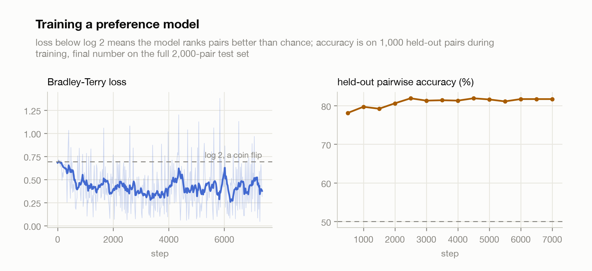
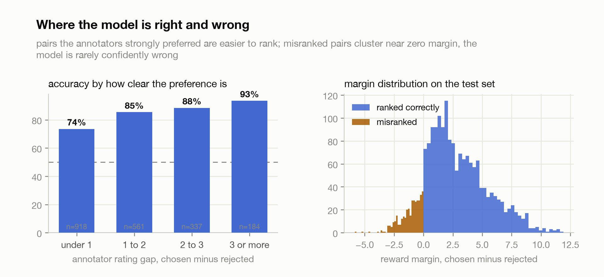
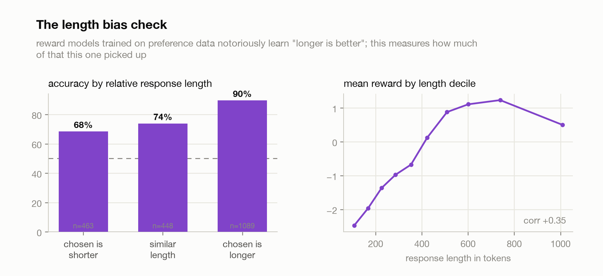
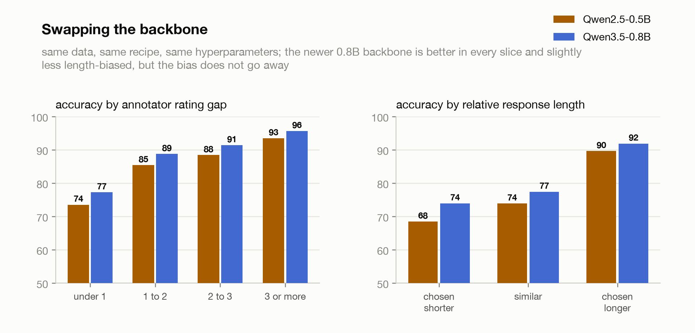

# Reward modelling

A reward model trained with the Bradley-Terry formulation (Bradley & Terry,
1952), the same recipe RLHF pipelines use for their preference stage (Stiennon
et al., 2020; Ouyang et al., 2022). Take a language model, replace its output
head with a single scalar, and train it on pairs of responses where humans
picked a winner: the loss is negative log sigmoid of the score gap, which is
exactly logistic regression on "which of these two is better". The model never
sees an absolute quality label, only comparisons, and out falls a scalar
reward you could hand to PPO.

The backbone is Qwen2.5-0.5B-Instruct with a hand-written value head, in
[train.py](src/train.py). Data is
[argilla/ultrafeedback-binarized-preferences-cleaned](https://huggingface.co/datasets/argilla/ultrafeedback-binarized-preferences-cleaned):
60,917 prompts, each with a GPT-4-rated chosen and rejected response, of which
I hold out 2,000 pairs for testing. One epoch, batch 8, lr 1e-5, about an hour
on the sandbox GPU.

## The result

**81.2%** pairwise accuracy on the 2,000 held-out pairs, against a 50% coin
flip. Accuracy saturates about a third of the way through the epoch; the rest
of the data buys margin, not ranking.

<picture>
  <source media="(prefers-color-scheme: dark)" srcset="assets/curves_dark.png">
  
</picture>

The errors are where you would want them. Accuracy climbs monotonically with
how strongly the annotators preferred the chosen response: 74% on pairs the
raters barely split on (gap under 1 point on a 5-point scale), 93% on pairs
they split hard. And when the model is wrong it is timidly wrong: misranked
pairs have a mean margin of -1.1 against +3.3 for correct ones, so the
mistakes cluster near zero where the model is effectively saying "close call".

<picture>
  <source media="(prefers-color-scheme: dark)" srcset="assets/analysis_dark.png">
  
</picture>

## The length bias

Reward models trained on preference data notoriously learn "longer is
better", and mine is no exception:

<picture>
  <source media="(prefers-color-scheme: dark)" srcset="assets/length_bias_dark.png">
  
</picture>

When the chosen response happens to be the longer one, the model gets 90% of
pairs right. When the annotators preferred the shorter response, accuracy
drops to 68%. Correlation between response length and reward is +0.35. Some
of this is inherited rather than invented: in the dataset itself the chosen
response is longer 65% of the time, so "longer is better" is a genuinely
useful heuristic on this distribution, and the model leans on it harder than
it should. The reward-by-length curve does bend back down past ~700 tokens,
so it learned "long", not "endless".

My favorite misranked pair makes the failure concrete. For a yes/no reasoning
question, the annotators gave 5.0 to the terse correct answer "Yes.
Confidence: 90%" and 3.5 to a rambling answer that recites the whole question
back. The model scores the terse one at -3.1 and the rambler at +1.5. On the
flip side, where quality is actually confounded with substance, the margins
are huge: a coherent on-topic review of an app pitch scores +6.1 while an
off-topic donut recipe scores -5.8.

## Swapping the backbone

Same data, same recipe, same hyperparameters, newer model: Qwen3.5-0.8B
instead of Qwen2.5-0.5B. It wins everywhere.

| backbone | accuracy | hardest pairs (gap under 1) | chosen shorter | length corr |
|---|--:|--:|--:|--:|
| Qwen2.5-0.5B-Instruct | 81.2% | 73.5% | 68.5% | +0.35 |
| Qwen3.5-0.8B | **84.6%** | **77.2%** | **73.9%** | **+0.30** |

<picture>
  <source media="(prefers-color-scheme: dark)" srcset="assets/comparison_dark.png">
  
</picture>

Two things stand out. First, the newer backbone was already at 80.8% accuracy
after 500 steps, the baseline's final level at 7% of the epoch, and kept
climbing to 84.6%. Second, the biggest single improvement (+5.4 points) is
exactly where the length bias hurts, pairs where the annotators preferred the
shorter answer. The bias shrinks but does not go away: the accuracy gap
between chosen-longer and chosen-shorter pairs narrows from 21 points to 18.
A better backbone buys judgment, and judgment substitutes for the length
heuristic, but does not replace it.

This is not a controlled ablation, the model is both a generation newer and
60% bigger, so "newer" and "bigger" are confounded. It is also slower per
step: Qwen3.5 is a hybrid linear-attention architecture, and training it
required the flash-linear-attention kernel package (see footnotes), running
at 1.3 steps/s against the baseline's 2.9.

## Honest footnotes

- Preferences here are GPT-4's ratings, not human ones. UltraFeedback is an
  AI-feedback dataset, so 81.2% means "agrees with GPT-4's rankings", and the
  ceiling is not 100%, the ratings themselves are noisy and sometimes wrong.
- Sequences are truncated to 1,536 tokens from the left, so for the ~3% of
  pairs with very long prompts the model judges a response to a prompt it
  only partially saw.
- Single seed per backbone. The two-backbone comparison hints the length
  bias shrinks as models improve, but with size and generation confounded,
  one seed each, and one dataset, it is a hint, not a finding.
- Qwen3.5 fought back before training at all. Its config has no top-level
  hidden_size (I read the width off the embedding matrix instead), and its
  gated DeltaNet layers have no efficient fallback in transformers: the naive
  path OOMed a 96GB GPU on one forward pass of batch 4. Installing
  flash-linear-attention fixed the forward but its tilelang backend failed to
  compile backward kernels against the box's CUDA headers; uninstalling
  tilelang dropped it to Triton kernels, which work (4.2GB peak for the same
  batch that OOMed at 96GB).
- The final checkpoint (1GB) stays out of the repo; results.json carries
  everything needed to rebuild the charts, including per-pair scores, lengths
  and ratings for all 2,000 test pairs.
- Three sandbox instances died during this project. The run that survived did
  so because a watcher re-ran a trivial notebook cell every two minutes to
  defeat the idle reaper, and mirrored partial results locally as insurance.

## Reproduce

```bash
pip install -r requirements.txt
python src/train.py
python src/plots.py
```

train.py downloads the dataset and model, trains, evaluates during training
on 1,000 held-out pairs and finally on all 2,000, and writes
`assets/results.json` plus the checkpoint. Pass `--batch-size 4 --accum 2`
for smaller cards. For the Qwen3.5 comparison run:

```bash
pip install flash-linear-attention
python src/train.py --model Qwen/Qwen3.5-0.8B --out assets_q35
```

then copy `assets_q35/results.json` to `assets/results_q35.json` and rerun
plots.py. If the tilelang backend fails to compile kernels on your CUDA
setup, uninstall tilelang and flash-linear-attention falls back to Triton.

## References

- Bradley & Terry (1952), Rank Analysis of Incomplete Block Designs: The Method of Paired Comparisons, Biometrika 39.
- Stiennon et al. (2020), [Learning to summarize from human feedback](https://arxiv.org/abs/2009.01325).
- Ouyang et al. (2022), [Training language models to follow instructions with human feedback](https://arxiv.org/abs/2203.02155). The RLHF recipe this feeds into.
- Cui et al. (2023), [UltraFeedback: Boosting Language Models with High-quality Feedback](https://arxiv.org/abs/2310.01377). Where the data comes from.
