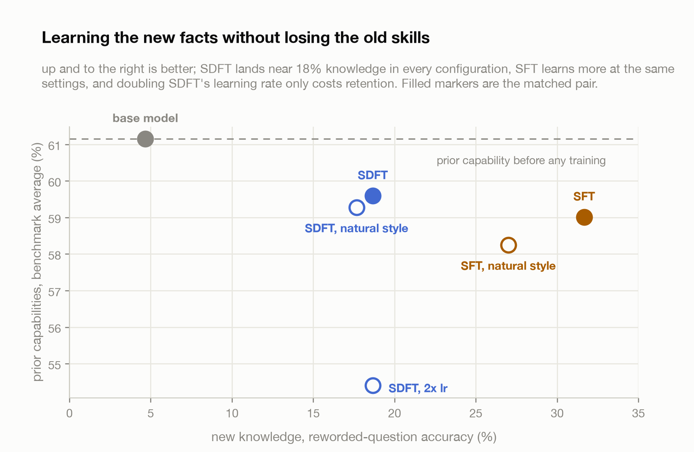
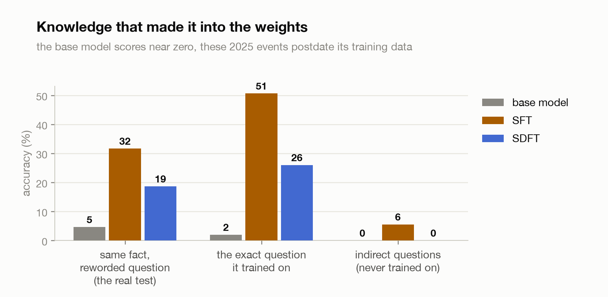
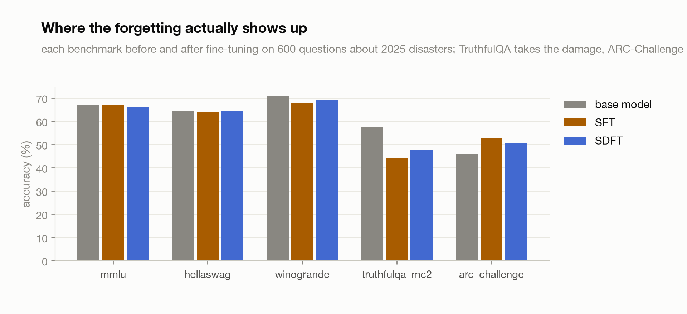
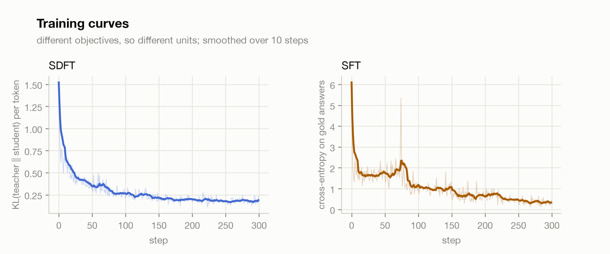

# Self-Distillation for Continual Learning

A from-scratch implementation of SDFT (Shenfeld et al., 2026), which teaches a
model new facts by letting it be its own teacher.

The idea is neat. If you want a model to learn something, you normally fine-tune
it on text somebody else wrote, which drags it away from its own distribution and
tends to damage whatever it could already do. SDFT instead puts the thing you want
it to learn into its own prompt, so in-context learning gives you a better version
of the same model for free, and then trains the model without the prompt to match
that better version. The teacher and the student are the same weights. The only
difference between them is what they can see.

I ran this on Qwen2.5-3B-Instruct, injecting facts about 2025 natural disasters
that postdate its training data. The headline, stated plainly: **the paper's
knowledge result did not reproduce at this scale, and I audited every part of the
pipeline trying to find my own bug before believing that.** SFT learned more facts
than SDFT in every configuration I tried. What did reproduce is the paper's
retention claim, directionally: at matched settings SDFT always kept more prior
capability than SFT, most visibly on TruthfulQA.

## The result

<picture>
  <source media="(prefers-color-scheme: dark)" srcset="assets/tradeoff_dark.png">
  
</picture>

| run | new facts (reworded) | prior caps avg | TruthfulQA |
|---|--:|--:|--:|
| base | 4.7% | 0.612 | 0.577 |
| SFT | **31.7%** | 0.590 | 0.440 |
| SDFT | 18.7% | **0.596** | **0.475** |
| SFT, natural style | 27.0% | 0.582 | 0.371 |
| SDFT, natural style | 17.7% | **0.593** | **0.446** |
| SDFT, 2x learning rate | 18.7% | 0.544 | 0.374 |

Two things to read off that table. SDFT lands at 18 plus or minus one percent on
new knowledge in **every** configuration: double the learning rate, change the
prompt style, triple the rollout budget, nothing moves it. And in both matched
pairs SDFT retains more than SFT (+0.6 and +1.1 points on the average, +3.5 and
+7.5 on TruthfulQA). The retention direction matches the paper. The knowledge gap
does not: the paper has SDFT at 89% against SFT's 80% on its knowledge task, at 7B.

## The method, and what has to be true for it to work

Two prompts, same weights:

```
student   [question]
teacher   [question] + [the source passage] + [an example answer]
```

The student is what you deploy. The teacher is a scaffolded version of the same
model that can see the answer. Training is three steps per batch:

1. the student answers the question on its own, badly at first
2. the teacher scores **that same answer**, while looking at the passage
3. the student is pulled toward the teacher's distribution, token by token

Then the teacher's weights get nudged toward the student's with an EMA
(`phi <- alpha * theta + (1 - alpha) * phi`, alpha 0.02). The teacher is not a
frozen pretrained model, it tracks training. That detail is easy to miss.

Step 1 is what makes this on-policy and is the entire difference from SFT. SFT
trains on gold text the model did not write. SDFT trains on the model's own
output, so it learns to fix its own mistakes rather than to imitate a stranger.

One discrepancy worth flagging: the paper writes the objective as reverse KL,
`D_KL(student || teacher)`, but the authors' released code says every result was
produced with per-token **forward** KL, the GKD formulation. I implemented forward
KL as the default for that reason, with `--direction reverse` available.

### Checking the premise before trusting anything

The method only works if the passage actually makes the model better. It does,
by a lot:

| | value |
|---|--:|
| base model on these questions | 2% |
| same model with the passage in its prompt | **88%** |
| gold-answer NLL, no passage | 3.62 nats/token |
| gold-answer NLL, with passage | **0.32** nats/token |

So there is an 86-point gap for SDFT to move into the weights. The teacher signal
is real and strong. Anything that goes wrong afterwards is not because the teacher
had nothing to say.

### The bug this design invites

The student and the teacher read different prompts but score the same response
tokens, so their positions do not line up. A response token at index `j` sits at
absolute position `prompt_len + j` and is predicted by the logit at
`prompt_len + j - 1`. Get that offset wrong and nothing crashes: the KL still
computes, the loss still falls, and the model trains on garbage.

So [tests/test_alignment.py](tests/test_alignment.py) checks it directly, by
exploiting the fact that greedy decoding is reproducible. Generate a response with
argmax sampling, re-score it in one forward pass, and the argmax of correctly
aligned logits has to be the tokens you just generated:

```
165 greedy tokens
  our alignment (p+j-1): 93.9%
  shifted +1           :  1.8%
  shifted -1           :  0.6%
```

Not 100% because bf16 makes cached generation and a fresh forward pass disagree on
near-ties. The point is the landslide.

## The mistake that cost me the first three runs

My first version of this experiment produced a flat zero for every method and
every learning rate, and the way that resolved is one of the two most useful
things in this writeup.

I generated questions from each passage and split them randomly into train and
test. Reasonable-looking, and completely broken. A test question would ask about
some fact that no training question happened to mention, and no amount of training
can produce an answer that was never in the data.

The measurement that caught it:

| | accuracy |
|---|--:|
| SFT on the questions it trained on | **100%** |
| SFT on held-out questions | **0%** |

Perfect memorisation, zero transfer. The models were learning exactly what I gave
them. I was grading them on material I never taught. My QA set was about 0.35x the
size of the source corpus in tokens; the paper's is about **5x**, roughly fourteen
times denser, so most of their facts get asked several ways by accident.

The fix is to stop relying on luck: generate **two differently worded questions
per fact**, train on one, test on the other. The fact is then guaranteed to be in
training, while the test still cannot be passed by memorising a string (median
lexical overlap between the two wordings is 0.36 Jaccard; only 3 of 600 pairs
exceed 0.8).

```
fact    5.8 million people experienced MMI IX shaking
train   In the 2025 Myanmar earthquake, how many people were estimated to have
        experienced MMI IX (Violent) shaking across four regions?
test    What was the estimated number of individuals subjected to level IX on the
        Modified Mercalli Intensity scale during the 2025 Myanmar earthquake?
```

An earlier signal pointed the same way and I nearly missed it. At a low learning
rate SDFT showed no accuracy gain at all, but the gold answers had become about
six times more likely under the model (NLL 3.62 down to 1.80). Accuracy is a
threshold on top of a distribution, and it can stay pinned at zero while the
distribution moves a long way underneath it.

## Auditing the negative result

SFT beating SDFT is the opposite of the paper, so before writing it down I went
looking for my own bug. Every check came back clean, and two of them produced
findings of their own:

| suspect | verdict |
|---|---|
| logit alignment off by one | clean, the 93.9% test above |
| judge unfair to long answers | clean, zero verdict flips when the cap goes 96 to 256 |
| generation cap truncating SDFT's verbose answers | ruled out, 15.0% accuracy at both caps |
| paraphrase pairs secretly near-duplicates | ruled out, median Jaccard 0.36 |
| EMA teacher degrading over training | opposite: the final teacher scores **95%** with context |
| SDFT undertrained | ruled out, identical accuracy at 2x the learning rate |
| answer-style prompt strangling the distillation channel | tested directly, see below |

The last row was my strongest hypothesis. My first setup forced "reply in one
short sentence" with 96-token rollouts, while the paper's teacher demonstrates
"including the thinking process" with a 1024-token budget, so I was compressing
the very distribution SDFT distills. I reran both methods with the paper-faithful
template: neutral system prompt, thinking-process demonstration, 256-token
rollouts. SDFT moved from 18.7% to 17.7%. Hypothesis dead. The knowledge ceiling
is the objective at this scale, not my prompt.

The audit's best artifact is what the natural-style SDFT model actually says at
eval time, with no passage anywhere in its prompt:

> "The thinking process involves carefully reading through the provided source
> passage to find the relevant information... **From the passage, we can see
> that** the National Disaster Management Authority..."

It then invents the passage's contents. The student distilled the teacher's
*form*, down to citing a source it cannot see, without the *facts* that form was
carrying. That is the failure mode of this method at 3B in one sentence: style
transfers easily, specifics do not.

Why specifics favour SFT makes sense on reflection. SFT's cross-entropy pins the
exact gold string ("238", "45 km southeast") with full weight on every token. SDFT
spreads its gradient across the teacher's whole distribution over the student's
own samples, which is gentle exactly where fact injection needs to be sharp. SDFT's
wrong answers are near misses in the right neighbourhood (November 10 for November
12, 130 km for 45 km), the signature of mass moved but not enough to flip an
argmax.

## What the models actually learned

<picture>
  <source media="(prefers-color-scheme: dark)" srcset="assets/knowledge_dark.png">
  
</picture>

The base model does not fail these questions by refusing. It confabulates,
fluently and with total confidence:

| question | gold | base model | SFT | SDFT |
|---|---|---|---|---|
| Nationality of the two killed by falling debris in Mandalay | French | "Australian tourists" | French | French |
| Tsunami damage in Crescent City, California | $1 million | "$10 million" | $1 million | $1 million |
| County of the first flash flood warning, July 2025 Texas | Bandera County | "Baylor County" | Bandera County | Bandera County |

Both methods fix this for a decent fraction of facts. Neither transfers to the
indirect questions, which ask about the same events without naming the source
(SFT 5.6%, SDFT 0%). Whatever is going into the weights stays tightly bound to
the question form it arrived in.

### The methods move the model in opposite directions

| | mean answer length |
|---|--:|
| base | 14.4 words |
| SFT | **2.4 words** |
| SDFT | **31.4 words** |

SFT collapsed the model into a terse answer machine, because the gold answers it
imitated are terse. That is the off-policy distribution shift the paper is about,
visible without any benchmark. SDFT went the other way, toward its verbose
teacher. Neither preserved the original style, but only one was pulled there by
text it did not write.

## Where the forgetting shows up

<picture>
  <source media="(prefers-color-scheme: dark)" srcset="assets/forgetting_dark.png">
  
</picture>

The averages hide the interesting part. MMLU, HellaSwag and Winogrande barely move
for either method. Almost all the damage lands on **TruthfulQA** (0.577 base,
0.440 SFT, 0.475 SDFT), and **ARC-Challenge goes up** for both (0.458 to 0.528
and 0.508).

That pattern makes sense if what fine-tuning mostly changes here is answering
style rather than knowledge. TruthfulQA rewards hedging and refusing a confident
wrong answer, exactly the habit that 600 rounds of short confident factual answers
trains out of a model. ARC is short-form QA, the format the model just practised.
So "catastrophic forgetting" at this scale is less knowledge loss than a new
answering style that is wrong for one benchmark and right for another.

This is also where the paper's claim survives: in both matched pairs, SDFT's
on-policy pull kept the model closer to itself (TruthfulQA +3.5 and +7.5 over
SFT). The mechanism the paper describes is real. At 3B it just does not come with
enough fact injection to win the trade.

## Training curves

<picture>
  <source media="(prefers-color-scheme: dark)" srcset="assets/curves_dark.png">
  
</picture>

Both converge cleanly. SDFT's KL falls 1.52 to 0.24, SFT's cross-entropy 6.10 to
0.44. Two panels rather than two y-axes, because KL and cross-entropy are
different units and one scale would be a lie.

## Setup

| | |
|---|---|
| Model | Qwen2.5-3B-Instruct (paper's primary is 7B) |
| Hardware | 1x RTX PRO 6000 Blackwell, 96GB, bf16 |
| Corpus | 9 Wikipedia articles on 2025 disasters, 279k chars |
| Data | 600 facts, two question wordings each, plus 108 indirect questions |
| Training | 4 epochs, batch 8, lr 5e-5, AdamW, cosine, 10 warmup steps |
| SDFT | EMA alpha 0.02, temperature 1.0, forward KL |
| Styles | "short": one-sentence answers, 96-token rollouts. "natural": paper-faithful, 256 |
| Question and judge model | deepseek-v4-flash (paper uses GPT-4/5) |
| Forgetting suite | MMLU, HellaSwag, Winogrande, TruthfulQA, ARC-Challenge via lm-eval |

Peak memory 38GB: a 3B student, its EMA teacher copy and AdamW states fit with
room to spare. SDFT costs about 2.7s/step at 96-token rollouts (5 to 6s at 256)
against SFT's 1s, all of it in the rollout.

## Caveats

Benchmarks are subsampled (40 per MMLU subtask, 400 to 500 elsewhere) so seven
full evaluations stay affordable, which puts a couple points of noise on every
retention number. The retention gaps I report (0.6 to 1.1 points on the average)
are the same size as that noise; the TruthfulQA gaps (3.5 to 7.5 points) are
larger and consistent in direction across both pairs, which is why I trust the
direction more than any single number.

Single seed, one model size, one task, and eval questions differ from the paper's
in structure: my test is strictly reworded questions about trained facts, while
the paper samples eval questions from the same dense generated pool it trains on,
which is a friendlier test. Grading is an LLM judge, which I got wrong once in a
way worth admitting: my first judge scored everything correct because
`"INCORRECT".endswith("CORRECT")` is `True`. It now matches whole words, and the
0% and 100% figures above are from the fixed judge.

## What I would try next

- **7B.** The paper says the effect grows with scale and its 3B results are its
  weakest. Every mechanism checks out here, so scale is the likeliest missing
  ingredient, and the audit table is exactly the checklist I would rerun.
- **Denser questions per fact.** Three or four wordings instead of two, closer to
  the paper's 5x corpus ratio, and check whether the indirect transfer that both
  methods failed at starts to appear.
- **Reverse KL**, the version the paper's equations describe, against the forward
  KL its code uses. Mode-seeking might sharpen exactly the specifics that forward
  KL smears.
- **A hybrid**: SFT's cross-entropy on the gold answer plus a small SDFT-style KL
  anchor to the demonstration-conditioned teacher. If forgetting is mostly style
  drift, the anchor should buy TruthfulQA back without giving up SFT's fact
  injection.

## Reproduce

```bash
pip install -r requirements.txt
export DEEPSEEK_API_KEY=...        # for question generation and grading

python src/data.py --out assets                     # fetch articles, build fact pairs
python src/train.py --method sft
python src/train.py --method sdft
python src/train.py --method sdft --style short     # the ablation that started the audit
python src/evaluate.py --model runs/sdft-natural --label SDFT --out assets/sdft.json
python tests/test_alignment.py                      # the off-by-one guard
python src/plots.py                                 # rebuild the charts
```

## Repository layout

```
requirements.txt
src/
  data.py       fetch articles, generate two question wordings per fact
  sdft.py       the objective: two prompt styles, aligned logits, EMA teacher, KL
  train.py      SDFT and SFT loops, matched settings, --style natural|short
  evaluate.py   LLM judge, paraphrase/trained/indirect accuracy, lm-eval suite
  plots.py      rebuild the README charts
tests/
  test_alignment.py   proves the logit offset is right
assets/
  qa_pairs.json       the 600 facts with both wordings
  results.json        all six runs, every number in this README
  audit.json          the cap test, lr probes and coverage probes
  history_*.json      training curves
```

## References

- Shenfeld et al. (2026). [Self-Distillation Enables Continual Learning](https://arxiv.org/abs/2601.19897).
- Agarwal et al. (2024). [On-Policy Distillation of Language Models: Learning from Self-Generated Mistakes](https://arxiv.org/abs/2306.13649), the GKD paper, whose per-token on-policy KL is what this actually optimises.
- Snell, Klein, Zhong (2022). [Learning by Distilling Context](https://arxiv.org/abs/2209.15189), the earlier version of the same trick.
