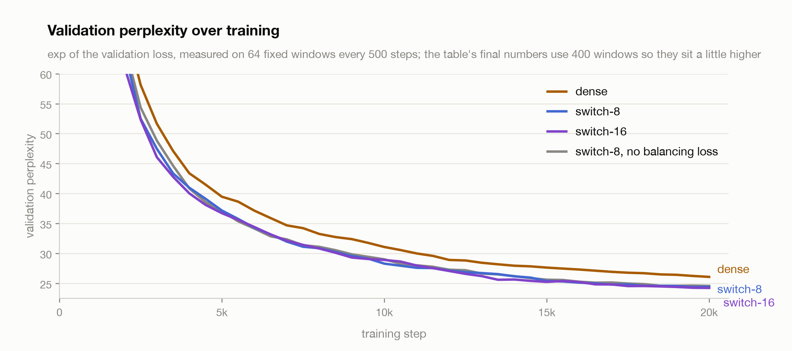
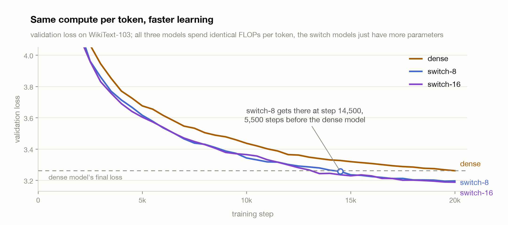
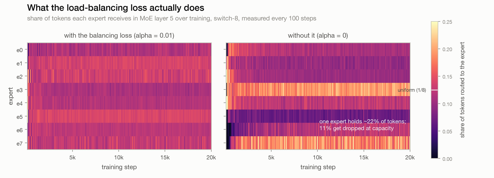
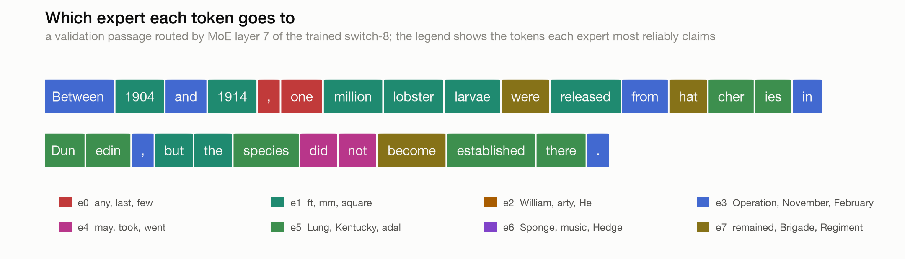

# Switch Transformer

A from-scratch Switch Transformer (Fedus et al., 2021), the top-1 mixture of
experts. The pitch of the paper is that you can grow a model's parameter count
without growing its compute: replace the FFN in some layers with a pool of
identical FFNs (experts) and route each token to exactly one of them. Every
token still does the work of one FFN, the model just has many more parameters
to store knowledge in. The claim worth testing is that at a fixed compute
budget, this trains faster and lands lower than a dense model.

I trained a dense 51M GPT and switch variants of it on WikiText-103, all with
identical FLOPs per token, and the claim holds on my hardware.

## The result

Validation perplexity at 512 tokens after 20,000 steps. Every model spends the
same compute per token; the switch models just carry more parameters.

| model | params | active per token | val ppl | steps/s |
|---|--:|--:|--:|--:|
| dense | 51.0M | 51.0M | 28.05 | 18.3 |
| switch-8 | 109.8M | 51.0M | **26.17** | 14.2 |
| switch-16 | 177.0M | 51.0M | **25.67** | 11.8 |
| switch-8, no balancing loss | 109.8M | 51.0M | 26.32 | 14.1 |

<picture>
  <source media="(prefers-color-scheme: dark)" srcset="assets/val_ppl_dark.png">
  
</picture>

<picture>
  <source media="(prefers-color-scheme: dark)" srcset="assets/sample_efficiency_dark.png">
  
</picture>

The headline is sample efficiency. switch-8 reaches the dense model's final
validation loss at step 14,500 and switch-16 at 13,500, so the dense model
needed about 40% more steps to get where the switch models passed through.
This is the paper's core claim reproduced at toy scale: same compute per
token, more parameters, faster learning.

The honest footnote is wall clock. My routing is a plain Python loop over
experts on one GPU, so switch-8 runs at 14.2 steps/s against dense's 18.3, and
the step advantage mostly cancels out in minutes. The paper gets its 7x
speedups from expert parallelism across many devices, where the extra
parameters cost almost nothing extra per step. What survives at my scale is
the per-step claim, not the per-second one.

## How routing works

Each MoE layer replaces the FFN with `n_experts` identical FFNs and a router,
which is just a `Linear(d_model, n_experts)`. For every token:

1. Softmax the router logits, take the argmax expert. That expert alone
   processes the token. Top-1 is the whole trick of this paper; the earlier
   Shazeer et al. (2017) mixture used top-2 with noise and the Switch paper
   showed one is enough.
2. Multiply the expert's output by the router probability. This is what makes
   routing differentiable: the argmax itself has no gradient, but scaling by
   the probability lets the router learn to be more or less confident.
3. Each expert accepts at most `1.25 * tokens / n_experts` tokens per batch
   (capacity factor). Tokens over capacity are dropped, meaning they skip the
   FFN and pass through on the residual stream.

Two details from the paper that matter more than they look:

- **The router runs in fp32** even though the rest of training is bf16.
  Routing decisions sit right before a softmax, where bf16 rounding is enough
  to flip argmaxes and destabilize training. The paper calls this selective
  precision; it costs nothing at this size.
- **The load-balancing loss.** Left alone, routing has a rich-get-richer
  problem: a slightly favored expert gets more tokens, learns faster, gets
  more favored. The fix is `alpha * E * sum(f_i * P_i)` per MoE layer, where
  `f_i` is the fraction of tokens expert i actually received and `P_i` the
  mean router probability it was assigned. It is minimized when routing is
  uniform, and `alpha = 0.01` is enough to keep things level.

The model is otherwise the same 8-layer pre-norm GPT as my
[positional-encodings](../positional-encodings) project (d_model 512, 8 heads,
d_ff 2048, RoPE, GPT-2 BPE), with every other layer's FFN switched out, so
layers 1, 3, 5, 7 are MoE.

## What the balancing loss actually does

I trained switch-8 twice, once with `alpha = 0.01` and once with `alpha = 0`,
logging how many tokens each expert received every 100 steps.

<picture>
  <source media="(prefers-color-scheme: dark)" srcset="assets/expert_utilization_dark.png">
  
</picture>

With the loss, every expert holds close to 1/8 of the tokens for the entire
run and effectively nothing gets dropped. Without it, the imbalance the router
falls into in the first few hundred steps never heals: one expert holds about
22% of the tokens, two others starve at 3 to 5%, and 4 to 11% of all tokens
blow past the hot expert's capacity and get dropped every single step.

What surprised me is that this is not the total collapse the textbook story
suggests. I expected all tokens routing to one expert; instead the run trains
almost fine and ends only 0.15 ppl behind the balanced one, 26.32 against
26.17. I think the capacity limit itself is doing quiet regularization, since
the hot expert physically cannot take more than 1.25/8 of the batch, so the
rich-get-richer loop has a ceiling. So at this scale the balancing loss is
less about preventing disaster and more about not throwing away 5 to 10% of
your gradient updates as dropped tokens.

## What the experts learn

The fun part. I ran the trained switch-8 over 200k validation tokens and
recorded which expert layer 7 routed every token to. The experts specialized,
without anyone asking them to:

| expert | most reliably claimed tokens |
|---|---|
| e3 | November, February, April, July, January, October, $, Operation |
| e4 | may, would, could, will, should, took, went, did |
| e2 | William, John, George, David, Thomas, He, he |
| e1 | ft, mm, km, kilometres, square, million |
| e7 | Brigade, Regiment, Battalion, was, been, be |
| e6 | music, film, video, album, media |

A months-and-dates expert, a modal-verbs expert, a first-names expert, a
units expert. This mirrors the qualitative findings in the paper's appendix,
showing up here in a 110M toy model.

<picture>
  <source media="(prefers-color-scheme: dark)" srcset="assets/routed_tokens_dark.png">
  
</picture>

Look at what happens in "Between 1904 and 1914": the words "Between", "and",
"from" and "in" go to the dates expert e3, while the years themselves go to
e1 with the measurements. Routing is contextual, not a lexical lookup table;
the router reads the hidden state, not the token identity, and the hidden
state of "Between" in a date range knows it is doing date work.

## Data

WikiText-103 (`Salesforce/wikitext` parquet mirror), tokenized once with GPT-2
BPE into flat `uint16` arrays, 118M train tokens and 247k validation tokens,
memory-mapped. Same pipeline as positional-encodings. Validation loss during
training is measured on a fixed set of 64 windows every 500 steps; the final
perplexity uses 400 windows.

## Training

| | |
|---|---|
| Hardware | 1x RTX PRO 6000 Blackwell, bf16 (router in fp32) |
| Optimizer | AdamW, lr 3e-4, betas (0.9, 0.95), weight decay 0.1 |
| Schedule | 500-step warmup then cosine to 0.1x |
| Batch / context | 32 windows of 512 tokens |
| Steps | 20,000 per run |
| MoE | experts in layers 1/3/5/7, capacity factor 1.25, alpha 0.01 |

## Reproduce

```bash
pip install -r requirements.txt

python src/train.py --experts 0            # dense baseline
python src/train.py --experts 8            # switch-8
python src/train.py --experts 16           # switch-16
python src/train.py --experts 8 --alpha 0  # the ablation

# which tokens each expert claims, from the trained checkpoint
python src/routing.py --ckpt runs/switch8.pt

# rebuild the README charts from assets/results.json
python src/plots.py
```

## Repository layout

```
requirements.txt
src/
  model.py     GPT with SwitchFFN: fp32 router, top-1 dispatch, capacity, balancing loss
  train.py     train one config, log loss + expert loads + drop rate, eval perplexity
  routing.py   run the trained model over validation text, dump expert specialization
  plots.py     rebuild the README charts from results.json
assets/
  sample_efficiency_*.png    val loss vs steps at matched FLOPs (the main result)
  val_ppl_*.png              val perplexity vs steps for all four runs
  expert_utilization_*.png   expert loads over training, with and without the loss
  routed_tokens_*.png        a real sentence colored by expert assignment
  results.json               all curves, loads, drop rates, final numbers
  routing.json               per-expert top tokens and the routed sample passage
```

## Caveats

Single seed, single dataset, one small model per config. The 0.15 ppl gap
between the balanced and unbalanced switch-8 is within noise for one seed, so
the real cost of alpha = 0 here is the dropped tokens and the skewed loads,
which are measured directly, not the perplexity. Wall-clock comparisons are
against my naive single-GPU dispatch loop and say nothing about a proper
sharded implementation. And expert specialization is shown for layer 7;
earlier layers specialize too but less legibly.

## What I'd try next

- **Expert parallelism**, even just 2 GPUs, to see the wall-clock win the
  paper is actually about.
- **More experts at fixed FLOPs** (32, 64) to find where returns diminish;
  16 still helped over 8 here.
- **Top-2 routing** (the Shazeer version) against top-1 at matched compute.
- **Capacity factor sweep**, since 1.25 seems to double as a regularizer and
  I want to know what 1.0 and 2.0 do to the no-aux run.

## References

- Fedus, Zoph, Shazeer (2021). [Switch Transformers: Scaling to Trillion Parameter Models with Simple and Efficient Sparsity](https://arxiv.org/abs/2101.03961).
- Shazeer et al. (2017). [Outrageously Large Neural Networks: The Sparsely-Gated Mixture-of-Experts Layer](https://arxiv.org/abs/1701.06538).
- Press, Smith, Lewis (2021). [Train Short, Test Long: Attention with Linear Biases Enables Input Length Extrapolation](https://arxiv.org/abs/2108.12409).
